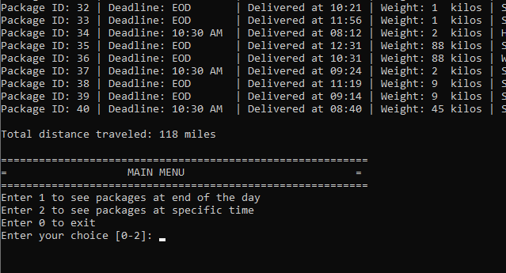

# WGUPS_Traveling_Salesman
Algorithim for optimizing delivery for WGUPS. This project is a take on the classic traveling salesman problem. 

I made a heuristic sort algorithm based on the closest neighbor approach to the traveling salesman problem. Where I had a starting point as a vertice, and sorted the edge from the starting point to every other vertice in the circuit. The vertice with the smallest weighted edge is chosen. This repeats until there is no other choice but to return to the starting point.
 
 ## Overview
For this project a list of packages and addresses are given. The following are some assumptions and constraints.

* Each truck can carry a maximum of 16 packages.
* Trucks travel at an average speed of 18 miles per hour.
* Trucks have an “infinite amount of gas” with no need to stop.
* Each driver stays with the same truck as long as that truck is in service.
* Drivers leave the hub at 8:00 a.m., with the truck loaded, and can return to the hub for packages if needed. The day ends when all 40 packages have been delivered.
* Delivery time is instantaneous, i.e., no time passes while at a delivery (that time is factored into the average speed of the trucks).
* There is up to one special note for each package.
* The wrong delivery address for package #9, Third District Juvenile Court, will be corrected at 10:20 a.m. The correct address is 410 S State St., Salt Lake City, UT 84111.
* The package ID is unique; there are no collisions.
* No further assumptions exist or are allowed.

## Screenshot

Total Distance Traveled

The main goal of the project is for your algorithm to optimize a total delivery route that comes in under 140miles round trip for all three truck loads.

My final distance traveled came in at 118 miles.

#Note
I want to footnote this project. The project in the GitHub repo is how I turned it in as a school project. While writing the write up to go along with my project submission, I realized how inefficient the sorting algorithm is. Currently, it calls the .sort function of a list which has a big O of nlogn, inside of a for loop (making it n^2logn). A quick solution to increase efficiency would have been to compare against the list index of 0 and insert at the 0 index if it was less than that index to find the lowest value in the list. As the algorithm is, it is not very scalable.
